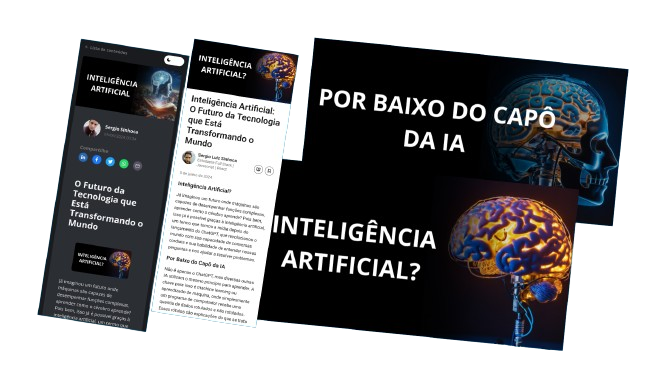
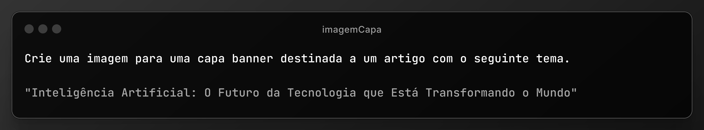

# <h1 align="center"> Informações do Projeto 📃 </h1>

## Sobre o Artigo
Este repositório tem como objetivo disponibilizar os arquivos utilizados no artigo **Inteligência Artificial: O Futuro da Tecnologia que Está Transformando o Mundo**, publicado no Linkedin e na plataforma da DIO.

> ℹ️ **NOTE:** O artigo foi desenvolvido através dos meus estudos pessoais, e toda a criação do texto em si foi de autoria humana. Não foi utilizada inteligência artificial (IA) para o desenvolvimento deste artigo, com exceção das imagens. Ressalto que a criação do texto original é de autoria humana. Para saber mais acesse o artigo abaixo.
   
Você pode ler o artigo completo no link abaixo:  

<a target="_blank" href="https://www.linkedin.com/pulse/intelig%2525C3%2525AAncia-artificial-o-futuro-da-tecnologia-que-luiz-sinhoca-svcif/?trackingId=vGraX3ypTtqop5F7qEOhgg%3D%3D" title="View PDF now"> 📕 Clique aqui para ler o artigo no Linkedin</a>

<a target="_blank" href="https://www.dio.me/articles/o-futuro-da-tecnologia-que-esta-transformando-o-mundo" title="View PDF now"> 📕 Clique aqui para ler o artigo na plataforma DIO</a>

No artigo publicado no LinkedIn, optei por não incluir toda as imagens. Todas as imagens mencionadas estão presentes no artigo da DIO.

## Imagens Utilizadas

As imagens utilizadas foram da plataforma 
<a target="_blank" href=" https://lexica.art/" title="View page">Lexica</a>, e foram organizadas utilizando a plataforma <a target="_blank" href=" https://www.canva.com/" title="View page">Canva</a>. A imagem da capa foi gerada na <a target="_blank" href=" https://copilot.microsoft.com/" title="View page">Copilot</a> com base no seguinte prompt:

  